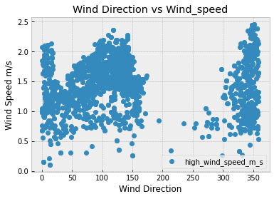
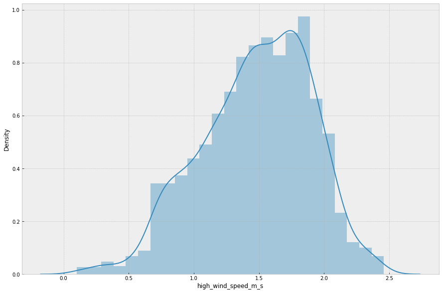
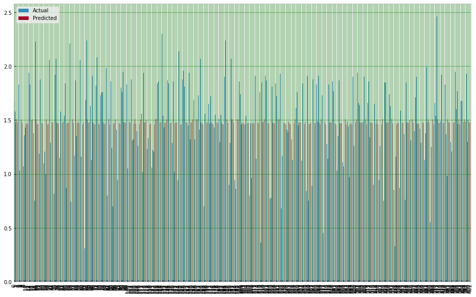
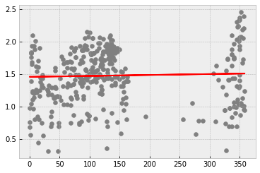

```python
import pandas as pd
import numpy as np
import csv
import matplotlib.pyplot as plt
import requests
plt.style.use("bmh")
import json
from pandas.io.json import json_normalize
import glob
import os
import json
import codecs
import numpy as np
from sklearn.linear_model import LinearRegression
import seaborn as sn
import matplotlib.pyplot as plt  
import seaborn as seabornInstance 
from sklearn.model_selection import train_test_split 
from sklearn.linear_model import LinearRegression
from sklearn import metrics
%matplotlib inline
import datetime as dt
```


```python
pip install seaborn
```

    Collecting seaborn
      Downloading seaborn-0.12.1-py3-none-any.whl (288 kB)
         ━━━━━━━━━━━━━━━━━━━━━━━━━━━━━━━━━━━━━━━ 288.2/288.2 kB 5.9 MB/s eta 0:00:0000:01
    [?25hRequirement already satisfied: matplotlib!=3.6.1,>=3.1 in /Library/Frameworks/Python.framework/Versions/3.10/lib/python3.10/site-packages (from seaborn) (3.5.2)
    Requirement already satisfied: numpy>=1.17 in /Library/Frameworks/Python.framework/Versions/3.10/lib/python3.10/site-packages (from seaborn) (1.22.4)
    Requirement already satisfied: pandas>=0.25 in /Library/Frameworks/Python.framework/Versions/3.10/lib/python3.10/site-packages (from seaborn) (1.4.2)
    Requirement already satisfied: cycler>=0.10 in /Library/Frameworks/Python.framework/Versions/3.10/lib/python3.10/site-packages (from matplotlib!=3.6.1,>=3.1->seaborn) (0.11.0)
    Requirement already satisfied: packaging>=20.0 in /Library/Frameworks/Python.framework/Versions/3.10/lib/python3.10/site-packages (from matplotlib!=3.6.1,>=3.1->seaborn) (21.3)
    Requirement already satisfied: pyparsing>=2.2.1 in /Library/Frameworks/Python.framework/Versions/3.10/lib/python3.10/site-packages (from matplotlib!=3.6.1,>=3.1->seaborn) (3.0.7)
    Requirement already satisfied: fonttools>=4.22.0 in /Library/Frameworks/Python.framework/Versions/3.10/lib/python3.10/site-packages (from matplotlib!=3.6.1,>=3.1->seaborn) (4.33.3)
    Requirement already satisfied: python-dateutil>=2.7 in /Library/Frameworks/Python.framework/Versions/3.10/lib/python3.10/site-packages (from matplotlib!=3.6.1,>=3.1->seaborn) (2.8.2)
    Requirement already satisfied: pillow>=6.2.0 in /Library/Frameworks/Python.framework/Versions/3.10/lib/python3.10/site-packages (from matplotlib!=3.6.1,>=3.1->seaborn) (9.1.1)
    Requirement already satisfied: kiwisolver>=1.0.1 in /Library/Frameworks/Python.framework/Versions/3.10/lib/python3.10/site-packages (from matplotlib!=3.6.1,>=3.1->seaborn) (1.4.2)
    Requirement already satisfied: pytz>=2020.1 in /Library/Frameworks/Python.framework/Versions/3.10/lib/python3.10/site-packages (from pandas>=0.25->seaborn) (2022.1)
    Requirement already satisfied: six>=1.5 in /Library/Frameworks/Python.framework/Versions/3.10/lib/python3.10/site-packages (from python-dateutil>=2.7->matplotlib!=3.6.1,>=3.1->seaborn) (1.16.0)
    Installing collected packages: seaborn
    Successfully installed seaborn-0.12.1
    Note: you may need to restart the kernel to use updated packages.


```python
df = pd.read_csv("./Forecast.csv")
```


```python
hourly = df[df['weatherSource'] == 'hourly']
hourly
```


<div>
<style scoped>
    .dataframe tbody tr th:only-of-type {
        vertical-align: middle;
    }

    .dataframe tbody tr th {
        vertical-align: top;
    }

    .dataframe thead th {
        text-align: right;
    }
</style>
<table border="1" class="dataframe">
  <thead>
    <tr style="text-align: right;">
      <th></th>
      <th>project</th>
      <th>weatherSource</th>
      <th>high_wind_speed_m_s</th>
      <th>low_temp_c</th>
      <th>high_screen_c</th>
      <th>rain_mm</th>
      <th>high_wind_direction</th>
    </tr>
    <tr>
      <th>time</th>
      <th></th>
      <th></th>
      <th></th>
      <th></th>
      <th></th>
      <th></th>
      <th></th>
    </tr>
  </thead>
  <tbody>
    <tr>
      <th>2022-11-28T18:00Z</th>
      <td>Amersham Vent Shaft</td>
      <td>hourly</td>
      <td>0.15</td>
      <td>7.89</td>
      <td>7.89</td>
      <td>0.0</td>
      <td>3</td>
    </tr>
    <tr>
      <th>2022-11-28T19:00Z</th>
      <td>Amersham Vent Shaft</td>
      <td>hourly</td>
      <td>0.55</td>
      <td>6.52</td>
      <td>6.52</td>
      <td>0.0</td>
      <td>22</td>
    </tr>
    <tr>
      <th>2022-11-28T20:00Z</th>
      <td>Amersham Vent Shaft</td>
      <td>hourly</td>
      <td>1.51</td>
      <td>6.19</td>
      <td>6.19</td>
      <td>0.0</td>
      <td>306</td>
    </tr>
    <tr>
      <th>2022-11-28T21:00Z</th>
      <td>Amersham Vent Shaft</td>
      <td>hourly</td>
      <td>1.65</td>
      <td>6.24</td>
      <td>6.24</td>
      <td>0.0</td>
      <td>321</td>
    </tr>
    <tr>
      <th>2022-11-28T22:00Z</th>
      <td>Amersham Vent Shaft</td>
      <td>hourly</td>
      <td>1.81</td>
      <td>6.19</td>
      <td>6.19</td>
      <td>0.0</td>
      <td>337</td>
    </tr>
    <tr>
      <th>...</th>
      <td>...</td>
      <td>...</td>
      <td>...</td>
      <td>...</td>
      <td>...</td>
      <td>...</td>
      <td>...</td>
    </tr>
    <tr>
      <th>2022-11-30T14:00Z</th>
      <td>Wendover</td>
      <td>hourly</td>
      <td>1.86</td>
      <td>7.37</td>
      <td>7.37</td>
      <td>0.0</td>
      <td>79</td>
    </tr>
    <tr>
      <th>2022-11-30T15:00Z</th>
      <td>Wendover</td>
      <td>hourly</td>
      <td>1.68</td>
      <td>NaN</td>
      <td>NaN</td>
      <td>0.0</td>
      <td>75</td>
    </tr>
    <tr>
      <th>2022-11-30T16:00Z</th>
      <td>Wendover</td>
      <td>hourly</td>
      <td>1.66</td>
      <td>NaN</td>
      <td>NaN</td>
      <td>0.0</td>
      <td>56</td>
    </tr>
    <tr>
      <th>2022-11-30T17:00Z</th>
      <td>Wendover</td>
      <td>hourly</td>
      <td>1.62</td>
      <td>NaN</td>
      <td>NaN</td>
      <td>0.0</td>
      <td>70</td>
    </tr>
    <tr>
      <th>2022-11-30T18:00Z</th>
      <td>Wendover</td>
      <td>hourly</td>
      <td>1.70</td>
      <td>NaN</td>
      <td>NaN</td>
      <td>0.0</td>
      <td>67</td>
    </tr>
  </tbody>
</table>
<p>2009 rows × 7 columns</p>
</div>


```python
three_hourly = df[df['weatherSource'] == 'three-hourly']
three_hourly
```


<div>
<style scoped>
    .dataframe tbody tr th:only-of-type {
        vertical-align: middle;
    }

    .dataframe tbody tr th {
        vertical-align: top;
    }

    .dataframe thead th {
        text-align: right;
    }
</style>
<table border="1" class="dataframe">
  <thead>
    <tr style="text-align: right;">
      <th></th>
      <th>project</th>
      <th>weatherSource</th>
      <th>time</th>
      <th>high_wind_speed_m_s</th>
      <th>low_temp_c</th>
      <th>high_screen_c</th>
      <th>rain_mm</th>
      <th>high_wind_direction</th>
    </tr>
  </thead>
  <tbody>
    <tr>
      <th>57</th>
      <td>Amersham Vent Shaft</td>
      <td>three-hourly</td>
      <td>2022-11-28T18:00Z</td>
      <td>0.15</td>
      <td>9.16</td>
      <td>9.16</td>
      <td>0.95</td>
      <td>3</td>
    </tr>
    <tr>
      <th>58</th>
      <td>Amersham Vent Shaft</td>
      <td>three-hourly</td>
      <td>2022-11-28T21:00Z</td>
      <td>1.65</td>
      <td>6.52</td>
      <td>6.52</td>
      <td>0.00</td>
      <td>321</td>
    </tr>
    <tr>
      <th>59</th>
      <td>Amersham Vent Shaft</td>
      <td>three-hourly</td>
      <td>2022-11-29T00:00Z</td>
      <td>2.01</td>
      <td>6.19</td>
      <td>6.19</td>
      <td>0.00</td>
      <td>348</td>
    </tr>
    <tr>
      <th>60</th>
      <td>Amersham Vent Shaft</td>
      <td>three-hourly</td>
      <td>2022-11-29T03:00Z</td>
      <td>2.30</td>
      <td>6.01</td>
      <td>6.01</td>
      <td>0.00</td>
      <td>345</td>
    </tr>
    <tr>
      <th>61</th>
      <td>Amersham Vent Shaft</td>
      <td>three-hourly</td>
      <td>2022-11-29T06:00Z</td>
      <td>2.33</td>
      <td>5.95</td>
      <td>5.95</td>
      <td>0.00</td>
      <td>348</td>
    </tr>
    <tr>
      <th>...</th>
      <td>...</td>
      <td>...</td>
      <td>...</td>
      <td>...</td>
      <td>...</td>
      <td>...</td>
      <td>...</td>
      <td>...</td>
    </tr>
    <tr>
      <th>4669</th>
      <td>Wendover</td>
      <td>three-hourly</td>
      <td>2022-12-05T06:00Z</td>
      <td>3.27</td>
      <td>3.01</td>
      <td>3.01</td>
      <td>0.00</td>
      <td>41</td>
    </tr>
    <tr>
      <th>4670</th>
      <td>Wendover</td>
      <td>three-hourly</td>
      <td>2022-12-05T09:00Z</td>
      <td>3.39</td>
      <td>3.40</td>
      <td>3.40</td>
      <td>0.00</td>
      <td>46</td>
    </tr>
    <tr>
      <th>4671</th>
      <td>Wendover</td>
      <td>three-hourly</td>
      <td>2022-12-05T12:00Z</td>
      <td>3.93</td>
      <td>4.54</td>
      <td>4.54</td>
      <td>0.00</td>
      <td>49</td>
    </tr>
    <tr>
      <th>4672</th>
      <td>Wendover</td>
      <td>three-hourly</td>
      <td>2022-12-05T15:00Z</td>
      <td>3.76</td>
      <td>4.67</td>
      <td>4.67</td>
      <td>0.00</td>
      <td>54</td>
    </tr>
    <tr>
      <th>4673</th>
      <td>Wendover</td>
      <td>three-hourly</td>
      <td>2022-12-05T18:00Z</td>
      <td>3.70</td>
      <td>4.50</td>
      <td>4.50</td>
      <td>0.00</td>
      <td>53</td>
    </tr>
  </tbody>
</table>
<p>2337 rows × 8 columns</p>
</div>


```python
daily = df[df['weatherSource'] == 'daily']
daily
```


<div>
<style scoped>
    .dataframe tbody tr th:only-of-type {
        vertical-align: middle;
    }

    .dataframe tbody tr th {
        vertical-align: top;
    }

    .dataframe thead th {
        text-align: right;
    }
</style>
<table border="1" class="dataframe">
  <thead>
    <tr style="text-align: right;">
      <th></th>
      <th>project</th>
      <th>weatherSource</th>
      <th>time</th>
      <th>high_wind_speed_m_s</th>
      <th>low_temp_c</th>
      <th>high_screen_c</th>
      <th>rain_mm</th>
      <th>high_wind_direction</th>
    </tr>
  </thead>
  <tbody>
    <tr>
      <th>0</th>
      <td>Amersham Vent Shaft</td>
      <td>daily</td>
      <td>2022-11-27T00:00Z</td>
      <td>1.75</td>
      <td>2.88</td>
      <td>11.90</td>
      <td>0.0</td>
      <td>0</td>
    </tr>
    <tr>
      <th>1</th>
      <td>Amersham Vent Shaft</td>
      <td>daily</td>
      <td>2022-11-28T00:00Z</td>
      <td>2.42</td>
      <td>5.22</td>
      <td>9.59</td>
      <td>0.0</td>
      <td>0</td>
    </tr>
    <tr>
      <th>2</th>
      <td>Amersham Vent Shaft</td>
      <td>daily</td>
      <td>2022-11-29T00:00Z</td>
      <td>1.21</td>
      <td>4.16</td>
      <td>7.22</td>
      <td>0.0</td>
      <td>0</td>
    </tr>
    <tr>
      <th>3</th>
      <td>Amersham Vent Shaft</td>
      <td>daily</td>
      <td>2022-11-30T00:00Z</td>
      <td>2.01</td>
      <td>3.66</td>
      <td>7.67</td>
      <td>0.0</td>
      <td>0</td>
    </tr>
    <tr>
      <th>4</th>
      <td>Amersham Vent Shaft</td>
      <td>daily</td>
      <td>2022-12-01T00:00Z</td>
      <td>2.65</td>
      <td>3.08</td>
      <td>6.53</td>
      <td>0.0</td>
      <td>0</td>
    </tr>
    <tr>
      <th>...</th>
      <td>...</td>
      <td>...</td>
      <td>...</td>
      <td>...</td>
      <td>...</td>
      <td>...</td>
      <td>...</td>
      <td>...</td>
    </tr>
    <tr>
      <th>4563</th>
      <td>Wendover</td>
      <td>daily</td>
      <td>2022-11-30T00:00Z</td>
      <td>2.11</td>
      <td>3.43</td>
      <td>7.68</td>
      <td>0.0</td>
      <td>0</td>
    </tr>
    <tr>
      <th>4564</th>
      <td>Wendover</td>
      <td>daily</td>
      <td>2022-12-01T00:00Z</td>
      <td>2.32</td>
      <td>3.14</td>
      <td>6.62</td>
      <td>0.0</td>
      <td>0</td>
    </tr>
    <tr>
      <th>4565</th>
      <td>Wendover</td>
      <td>daily</td>
      <td>2022-12-02T00:00Z</td>
      <td>3.73</td>
      <td>2.85</td>
      <td>5.64</td>
      <td>0.0</td>
      <td>0</td>
    </tr>
    <tr>
      <th>4566</th>
      <td>Wendover</td>
      <td>daily</td>
      <td>2022-12-03T00:00Z</td>
      <td>4.81</td>
      <td>2.68</td>
      <td>5.10</td>
      <td>0.0</td>
      <td>0</td>
    </tr>
    <tr>
      <th>4567</th>
      <td>Wendover</td>
      <td>daily</td>
      <td>2022-12-04T00:00Z</td>
      <td>4.45</td>
      <td>2.25</td>
      <td>4.71</td>
      <td>0.0</td>
      <td>0</td>
    </tr>
  </tbody>
</table>
<p>328 rows × 8 columns</p>
</div>


```python
daily['rolling_mean'] = daily['high_screen_c'].rolling(3).mean()
daily
```

    /var/folders/kv/3lkbh165621_d70364cccdq80000gn/T/ipykernel_14943/1782378625.py:1: SettingWithCopyWarning: 
    A value is trying to be set on a copy of a slice from a DataFrame.
    Try using .loc[row_indexer,col_indexer] = value instead
    
    See the caveats in the documentation: https://pandas.pydata.org/pandas-docs/stable/user_guide/indexing.html#returning-a-view-versus-a-copy
      daily['rolling_mean'] = daily['high_screen_c'].rolling(3).mean()


<div>
<style scoped>
    .dataframe tbody tr th:only-of-type {
        vertical-align: middle;
    }

    .dataframe tbody tr th {
        vertical-align: top;
    }

    .dataframe thead th {
        text-align: right;
    }
</style>
<table border="1" class="dataframe">
  <thead>
    <tr style="text-align: right;">
      <th></th>
      <th>project</th>
      <th>weatherSource</th>
      <th>time</th>
      <th>high_wind_speed_m_s</th>
      <th>low_temp_c</th>
      <th>high_screen_c</th>
      <th>rain_mm</th>
      <th>high_wind_direction</th>
      <th>rolling_mean</th>
    </tr>
  </thead>
  <tbody>
    <tr>
      <th>0</th>
      <td>Amersham Vent Shaft</td>
      <td>daily</td>
      <td>2022-11-27T00:00Z</td>
      <td>1.75</td>
      <td>2.88</td>
      <td>11.90</td>
      <td>0.0</td>
      <td>0</td>
      <td>NaN</td>
    </tr>
    <tr>
      <th>1</th>
      <td>Amersham Vent Shaft</td>
      <td>daily</td>
      <td>2022-11-28T00:00Z</td>
      <td>2.42</td>
      <td>5.22</td>
      <td>9.59</td>
      <td>0.0</td>
      <td>0</td>
      <td>NaN</td>
    </tr>
    <tr>
      <th>2</th>
      <td>Amersham Vent Shaft</td>
      <td>daily</td>
      <td>2022-11-29T00:00Z</td>
      <td>1.21</td>
      <td>4.16</td>
      <td>7.22</td>
      <td>0.0</td>
      <td>0</td>
      <td>9.570000</td>
    </tr>
    <tr>
      <th>3</th>
      <td>Amersham Vent Shaft</td>
      <td>daily</td>
      <td>2022-11-30T00:00Z</td>
      <td>2.01</td>
      <td>3.66</td>
      <td>7.67</td>
      <td>0.0</td>
      <td>0</td>
      <td>8.160000</td>
    </tr>
    <tr>
      <th>4</th>
      <td>Amersham Vent Shaft</td>
      <td>daily</td>
      <td>2022-12-01T00:00Z</td>
      <td>2.65</td>
      <td>3.08</td>
      <td>6.53</td>
      <td>0.0</td>
      <td>0</td>
      <td>7.140000</td>
    </tr>
    <tr>
      <th>...</th>
      <td>...</td>
      <td>...</td>
      <td>...</td>
      <td>...</td>
      <td>...</td>
      <td>...</td>
      <td>...</td>
      <td>...</td>
      <td>...</td>
    </tr>
    <tr>
      <th>4563</th>
      <td>Wendover</td>
      <td>daily</td>
      <td>2022-11-30T00:00Z</td>
      <td>2.11</td>
      <td>3.43</td>
      <td>7.68</td>
      <td>0.0</td>
      <td>0</td>
      <td>7.793333</td>
    </tr>
    <tr>
      <th>4564</th>
      <td>Wendover</td>
      <td>daily</td>
      <td>2022-12-01T00:00Z</td>
      <td>2.32</td>
      <td>3.14</td>
      <td>6.62</td>
      <td>0.0</td>
      <td>0</td>
      <td>7.010000</td>
    </tr>
    <tr>
      <th>4565</th>
      <td>Wendover</td>
      <td>daily</td>
      <td>2022-12-02T00:00Z</td>
      <td>3.73</td>
      <td>2.85</td>
      <td>5.64</td>
      <td>0.0</td>
      <td>0</td>
      <td>6.646667</td>
    </tr>
    <tr>
      <th>4566</th>
      <td>Wendover</td>
      <td>daily</td>
      <td>2022-12-03T00:00Z</td>
      <td>4.81</td>
      <td>2.68</td>
      <td>5.10</td>
      <td>0.0</td>
      <td>0</td>
      <td>5.786667</td>
    </tr>
    <tr>
      <th>4567</th>
      <td>Wendover</td>
      <td>daily</td>
      <td>2022-12-04T00:00Z</td>
      <td>4.45</td>
      <td>2.25</td>
      <td>4.71</td>
      <td>0.0</td>
      <td>0</td>
      <td>5.150000</td>
    </tr>
  </tbody>
</table>
<p>328 rows × 9 columns</p>
</div>


```python
r = daily[['low_temp_c', 'high_screen_c']].to_numpy()
x = daily['low_temp_c'].to_numpy()
y = daily['high_screen_c'].to_numpy()
```


```python
x = x.reshape(-1, 1)
y = y.reshape(-1, 1)
```


```python
model = LinearRegression()
```


```python
model.fit(x,y)
```


<style>#sk-container-id-2 {color: black;background-color: white;}#sk-container-id-2 pre{padding: 0;}#sk-container-id-2 div.sk-toggleable {background-color: white;}#sk-container-id-2 label.sk-toggleable__label {cursor: pointer;display: block;width: 100%;margin-bottom: 0;padding: 0.3em;box-sizing: border-box;text-align: center;}#sk-container-id-2 label.sk-toggleable__label-arrow:before {content: "▸";float: left;margin-right: 0.25em;color: #696969;}#sk-container-id-2 label.sk-toggleable__label-arrow:hover:before {color: black;}#sk-container-id-2 div.sk-estimator:hover label.sk-toggleable__label-arrow:before {color: black;}#sk-container-id-2 div.sk-toggleable__content {max-height: 0;max-width: 0;overflow: hidden;text-align: left;background-color: #f0f8ff;}#sk-container-id-2 div.sk-toggleable__content pre {margin: 0.2em;color: black;border-radius: 0.25em;background-color: #f0f8ff;}#sk-container-id-2 input.sk-toggleable__control:checked~div.sk-toggleable__content {max-height: 200px;max-width: 100%;overflow: auto;}#sk-container-id-2 input.sk-toggleable__control:checked~label.sk-toggleable__label-arrow:before {content: "▾";}#sk-container-id-2 div.sk-estimator input.sk-toggleable__control:checked~label.sk-toggleable__label {background-color: #d4ebff;}#sk-container-id-2 div.sk-label input.sk-toggleable__control:checked~label.sk-toggleable__label {background-color: #d4ebff;}#sk-container-id-2 input.sk-hidden--visually {border: 0;clip: rect(1px 1px 1px 1px);clip: rect(1px, 1px, 1px, 1px);height: 1px;margin: -1px;overflow: hidden;padding: 0;position: absolute;width: 1px;}#sk-container-id-2 div.sk-estimator {font-family: monospace;background-color: #f0f8ff;border: 1px dotted black;border-radius: 0.25em;box-sizing: border-box;margin-bottom: 0.5em;}#sk-container-id-2 div.sk-estimator:hover {background-color: #d4ebff;}#sk-container-id-2 div.sk-parallel-item::after {content: "";width: 100%;border-bottom: 1px solid gray;flex-grow: 1;}#sk-container-id-2 div.sk-label:hover label.sk-toggleable__label {background-color: #d4ebff;}#sk-container-id-2 div.sk-serial::before {content: "";position: absolute;border-left: 1px solid gray;box-sizing: border-box;top: 0;bottom: 0;left: 50%;z-index: 0;}#sk-container-id-2 div.sk-serial {display: flex;flex-direction: column;align-items: center;background-color: white;padding-right: 0.2em;padding-left: 0.2em;position: relative;}#sk-container-id-2 div.sk-item {position: relative;z-index: 1;}#sk-container-id-2 div.sk-parallel {display: flex;align-items: stretch;justify-content: center;background-color: white;position: relative;}#sk-container-id-2 div.sk-item::before, #sk-container-id-2 div.sk-parallel-item::before {content: "";position: absolute;border-left: 1px solid gray;box-sizing: border-box;top: 0;bottom: 0;left: 50%;z-index: -1;}#sk-container-id-2 div.sk-parallel-item {display: flex;flex-direction: column;z-index: 1;position: relative;background-color: white;}#sk-container-id-2 div.sk-parallel-item:first-child::after {align-self: flex-end;width: 50%;}#sk-container-id-2 div.sk-parallel-item:last-child::after {align-self: flex-start;width: 50%;}#sk-container-id-2 div.sk-parallel-item:only-child::after {width: 0;}#sk-container-id-2 div.sk-dashed-wrapped {border: 1px dashed gray;margin: 0 0.4em 0.5em 0.4em;box-sizing: border-box;padding-bottom: 0.4em;background-color: white;}#sk-container-id-2 div.sk-label label {font-family: monospace;font-weight: bold;display: inline-block;line-height: 1.2em;}#sk-container-id-2 div.sk-label-container {text-align: center;}#sk-container-id-2 div.sk-container {/* jupyter's `normalize.less` sets `[hidden] { display: none; }` but bootstrap.min.css set `[hidden] { display: none !important; }` so we also need the `!important` here to be able to override the default hidden behavior on the sphinx rendered scikit-learn.org. See: https://github.com/scikit-learn/scikit-learn/issues/21755 */display: inline-block !important;position: relative;}#sk-container-id-2 div.sk-text-repr-fallback {display: none;}</style><div id="sk-container-id-2" class="sk-top-container"><div class="sk-text-repr-fallback"><pre>LinearRegression()</pre><b>In a Jupyter environment, please rerun this cell to show the HTML representation or trust the notebook. <br />On GitHub, the HTML representation is unable to render, please try loading this page with nbviewer.org.</b></div><div class="sk-container" hidden><div class="sk-item"><div class="sk-estimator sk-toggleable"><input class="sk-toggleable__control sk-hidden--visually" id="sk-estimator-id-2" type="checkbox" checked><label for="sk-estimator-id-2" class="sk-toggleable__label sk-toggleable__label-arrow">LinearRegression</label><div class="sk-toggleable__content"><pre>LinearRegression()</pre></div></div></div></div></div>


```python
model = LinearRegression().fit(x, y)
```


```python
r_sq = model.score(x, y)
print(f"coefficient of determination: {r_sq}")

```

    coefficient of determination: 0.25674031060264746


```python
print(f"intercept: {model.intercept_}")
print(f"slope: {model.coef_}")
```

    intercept: [2.6911792]
    slope: [[1.21350704]]


```python
y_pred = model.predict(x)
print(f"predicted response:\n{y_pred}")
```

    predicted response:
    [[ 6.18607947]
     [ 9.02568595]
     [ 7.73936848]
     [ 7.13261496]
     [ 6.42878088]
     [ 6.19821454]
     [ 5.76135201]
     [ 5.15459849]
     [ 8.05488031]
     [ 8.33398693]
     [ 8.66163384]
     [ 7.33891116]
     [ 7.02339933]
     [ 6.67148229]
     [ 6.46518609]
     [ 5.91910792]
     [ 7.72723341]
     [ 8.37039215]
     [ 8.2247713 ]
     [ 6.90204863]
     [ 6.80496806]
     [ 6.8292382 ]
     [ 6.36810553]
     [ 5.87056764]
     [ 6.53799651]
     [ 7.08407468]
     [ 7.93352961]
     [ 6.69575243]
     [ 6.74429271]
     [ 6.53799651]
     [ 5.89483778]
     [ 5.5186506 ]
     [ 6.18607947]
     [ 9.02568595]
     [ 7.73936848]
     [ 7.13261496]
     [ 6.42878088]
     [ 6.19821454]
     [ 5.76135201]
     [ 5.15459849]
     [ 6.14967426]
     [ 9.38973806]
     [ 7.99420496]
     [ 7.35104623]
     [ 7.07193961]
     [ 6.93845384]
     [ 6.40451074]
     [ 5.54292074]
     [ 5.44584018]
     [ 7.87285426]
     [ 8.1034206 ]
     [ 6.63507708]
     [ 6.76856285]
     [ 6.55013158]
     [ 6.14967426]
     [ 5.53078567]
     [ 8.12769074]
     [ 8.16409595]
     [ 7.53307229]
     [ 6.98699412]
     [ 6.62294201]
     [ 6.24675482]
     [ 5.99191835]
     [ 5.34875961]
     [ 6.44091595]
     [10.1542475 ]
     [ 8.7587144 ]
     [ 8.16409595]
     [ 7.67869313]
     [ 7.44812679]
     [ 6.87777849]
     [ 6.18607947]
     [ 6.18607947]
     [ 9.02568595]
     [ 7.73936848]
     [ 7.13261496]
     [ 6.42878088]
     [ 6.19821454]
     [ 5.76135201]
     [ 5.15459849]
     [ 7.81217891]
     [ 9.03782102]
     [ 8.45533764]
     [ 7.14475003]
     [ 6.93845384]
     [ 6.97485905]
     [ 6.63507708]
     [ 6.00405342]
     [ 8.28544665]
     [ 8.97714567]
     [ 8.50387792]
     [ 7.46026187]
     [ 6.98699412]
     [ 7.19329032]
     [ 6.84137327]
     [ 6.25888989]
     [ 8.5524182 ]
     [ 7.07193961]
     [ 8.35825708]
     [ 7.27823581]
     [ 7.19329032]
     [ 7.55734243]
     [ 7.41172158]
     [ 6.59867187]
     [ 7.14475003]
     [ 8.58882341]
     [ 8.16409595]
     [ 6.95058891]
     [ 6.75642778]
     [ 6.80496806]
     [ 6.46518609]
     [ 5.83416243]
     [ 8.15196088]
     [ 9.23198214]
     [ 8.81938975]
     [ 7.5694775 ]
     [ 7.1568851 ]
     [ 7.30250595]
     [ 7.0355344 ]
     [ 6.45305102]
     [ 7.8971244 ]
     [ 9.02568595]
     [ 8.67376891]
     [ 7.31464102]
     [ 6.90204863]
     [ 7.0355344 ]
     [ 6.74429271]
     [ 6.21034961]
     [ 6.61080694]
     [ 7.26610074]
     [ 8.13982581]
     [ 6.63507708]
     [ 6.96272398]
     [ 6.46518609]
     [ 6.08899891]
     [ 5.56719088]
     [ 8.05488031]
     [ 9.23198214]
     [ 8.80725468]
     [ 7.63015285]
     [ 7.05980454]
     [ 7.2418306 ]
     [ 6.90204863]
     [ 6.28316004]
     [ 6.86564342]
     [ 7.47239694]
     [ 7.98206989]
     [ 6.46518609]
     [ 6.65934722]
     [ 6.22248468]
     [ 5.83416243]
     [ 5.36089468]
     [ 6.14967426]
     [10.51829961]
     [ 9.207712  ]
     [ 8.45533764]
     [ 8.33398693]
     [ 7.8971244 ]
     [ 7.18115525]
     [ 6.55013158]
     [ 7.52093722]
     [ 8.40679736]
     [ 7.8971244 ]
     [ 6.90204863]
     [ 6.41664581]
     [ 6.64721215]
     [ 6.34383539]
     [ 5.79775722]
     [ 8.21263623]
     [ 7.65442299]
     [ 8.61309355]
     [ 7.42385665]
     [ 7.66655806]
     [ 7.59374764]
     [ 7.0355344 ]
     [ 6.5015913 ]
     [ 8.05488031]
     [ 8.27331158]
     [ 8.68590398]
     [ 6.92631877]
     [ 7.12047989]
     [ 7.04766947]
     [ 6.46518609]
     [ 6.11326905]
     [ 7.63015285]
     [ 8.29758172]
     [ 7.67869313]
     [ 6.61080694]
     [ 6.14967426]
     [ 5.88270271]
     [ 5.49438046]
     [ 4.88762694]
     [ 8.33398693]
     [ 9.02568595]
     [ 8.72230919]
     [ 7.63015285]
     [ 7.1568851 ]
     [ 7.41172158]
     [ 7.12047989]
     [ 6.52586144]
     [ 8.38252722]
     [ 8.58882341]
     [ 8.57668834]
     [ 7.65442299]
     [ 7.20542539]
     [ 7.47239694]
     [ 7.18115525]
     [ 6.5865368 ]
     [ 6.14967426]
     [10.51829961]
     [ 9.207712  ]
     [ 8.45533764]
     [ 8.33398693]
     [ 7.8971244 ]
     [ 7.18115525]
     [ 6.55013158]
     [ 8.18836609]
     [ 8.80725468]
     [ 8.49174285]
     [ 7.44812679]
     [ 6.98699412]
     [ 7.18115525]
     [ 6.8292382 ]
     [ 6.25888989]
     [ 6.44091595]
     [10.1542475 ]
     [ 8.7587144 ]
     [ 8.16409595]
     [ 7.67869313]
     [ 7.44812679]
     [ 6.87777849]
     [ 6.18607947]
     [ 8.64949876]
     [ 7.64228792]
     [ 8.92860538]
     [ 7.29037088]
     [ 7.38745144]
     [ 7.47239694]
     [ 6.86564342]
     [ 6.42878088]
     [ 6.8292382 ]
     [ 8.30971679]
     [ 8.09128553]
     [ 6.1739444 ]
     [ 6.33170032]
     [ 6.12540412]
     [ 5.93124299]
     [ 5.40943497]
     [ 7.92139454]
     [ 9.17130679]
     [ 8.77084947]
     [ 7.53307229]
     [ 6.97485905]
     [ 7.14475003]
     [ 6.80496806]
     [ 6.19821454]
     [ 7.21756046]
     [ 8.80725468]
     [ 8.17623102]
     [ 6.93845384]
     [ 6.73215764]
     [ 6.76856285]
     [ 6.42878088]
     [ 5.79775722]
     [ 8.21263623]
     [ 7.65442299]
     [ 8.61309355]
     [ 7.42385665]
     [ 7.66655806]
     [ 7.59374764]
     [ 7.0355344 ]
     [ 6.5015913 ]
     [ 8.05488031]
     [ 8.27331158]
     [ 8.68590398]
     [ 6.92631877]
     [ 7.12047989]
     [ 7.04766947]
     [ 6.46518609]
     [ 6.11326905]
     [ 8.346122  ]
     [ 8.74657933]
     [ 8.68590398]
     [ 7.64228792]
     [ 7.26610074]
     [ 7.50880215]
     [ 7.22969553]
     [ 6.61080694]
     [ 6.86564342]
     [ 7.47239694]
     [ 7.98206989]
     [ 6.46518609]
     [ 6.65934722]
     [ 6.22248468]
     [ 5.83416243]
     [ 5.36089468]
     [ 6.72002257]
     [ 7.76363863]
     [ 8.12769074]
     [ 6.7078875 ]
     [ 6.84137327]
     [ 6.63507708]
     [ 6.23461975]
     [ 5.60359609]
     [ 6.8292382 ]
     [ 8.30971679]
     [ 8.09128553]
     [ 6.1739444 ]
     [ 6.33170032]
     [ 6.12540412]
     [ 5.93124299]
     [ 5.40943497]
     [ 8.33398693]
     [ 9.02568595]
     [ 8.72230919]
     [ 7.63015285]
     [ 7.1568851 ]
     [ 7.41172158]
     [ 7.12047989]
     [ 6.52586144]
     [ 8.83152482]
     [ 8.95287553]
     [ 8.4310675 ]
     [ 6.85350834]
     [ 6.5015913 ]
     [ 6.14967426]
     [ 5.94337806]
     [ 5.42157004]]


```python
y_pred = model.intercept_ + model.coef_ * x
print(f"predicted response:\n{y_pred}")
```

    predicted response:
    [[ 6.18607947]
     [ 9.02568595]
     [ 7.73936848]
     [ 7.13261496]
     [ 6.42878088]
     [ 6.19821454]
     [ 5.76135201]
     [ 5.15459849]
     [ 8.05488031]
     [ 8.33398693]
     [ 8.66163384]
     [ 7.33891116]
     [ 7.02339933]
     [ 6.67148229]
     [ 6.46518609]
     [ 5.91910792]
     [ 7.72723341]
     [ 8.37039215]
     [ 8.2247713 ]
     [ 6.90204863]
     [ 6.80496806]
     [ 6.8292382 ]
     [ 6.36810553]
     [ 5.87056764]
     [ 6.53799651]
     [ 7.08407468]
     [ 7.93352961]
     [ 6.69575243]
     [ 6.74429271]
     [ 6.53799651]
     [ 5.89483778]
     [ 5.5186506 ]
     [ 6.18607947]
     [ 9.02568595]
     [ 7.73936848]
     [ 7.13261496]
     [ 6.42878088]
     [ 6.19821454]
     [ 5.76135201]
     [ 5.15459849]
     [ 6.14967426]
     [ 9.38973806]
     [ 7.99420496]
     [ 7.35104623]
     [ 7.07193961]
     [ 6.93845384]
     [ 6.40451074]
     [ 5.54292074]
     [ 5.44584018]
     [ 7.87285426]
     [ 8.1034206 ]
     [ 6.63507708]
     [ 6.76856285]
     [ 6.55013158]
     [ 6.14967426]
     [ 5.53078567]
     [ 8.12769074]
     [ 8.16409595]
     [ 7.53307229]
     [ 6.98699412]
     [ 6.62294201]
     [ 6.24675482]
     [ 5.99191835]
     [ 5.34875961]
     [ 6.44091595]
     [10.1542475 ]
     [ 8.7587144 ]
     [ 8.16409595]
     [ 7.67869313]
     [ 7.44812679]
     [ 6.87777849]
     [ 6.18607947]
     [ 6.18607947]
     [ 9.02568595]
     [ 7.73936848]
     [ 7.13261496]
     [ 6.42878088]
     [ 6.19821454]
     [ 5.76135201]
     [ 5.15459849]
     [ 7.81217891]
     [ 9.03782102]
     [ 8.45533764]
     [ 7.14475003]
     [ 6.93845384]
     [ 6.97485905]
     [ 6.63507708]
     [ 6.00405342]
     [ 8.28544665]
     [ 8.97714567]
     [ 8.50387792]
     [ 7.46026187]
     [ 6.98699412]
     [ 7.19329032]
     [ 6.84137327]
     [ 6.25888989]
     [ 8.5524182 ]
     [ 7.07193961]
     [ 8.35825708]
     [ 7.27823581]
     [ 7.19329032]
     [ 7.55734243]
     [ 7.41172158]
     [ 6.59867187]
     [ 7.14475003]
     [ 8.58882341]
     [ 8.16409595]
     [ 6.95058891]
     [ 6.75642778]
     [ 6.80496806]
     [ 6.46518609]
     [ 5.83416243]
     [ 8.15196088]
     [ 9.23198214]
     [ 8.81938975]
     [ 7.5694775 ]
     [ 7.1568851 ]
     [ 7.30250595]
     [ 7.0355344 ]
     [ 6.45305102]
     [ 7.8971244 ]
     [ 9.02568595]
     [ 8.67376891]
     [ 7.31464102]
     [ 6.90204863]
     [ 7.0355344 ]
     [ 6.74429271]
     [ 6.21034961]
     [ 6.61080694]
     [ 7.26610074]
     [ 8.13982581]
     [ 6.63507708]
     [ 6.96272398]
     [ 6.46518609]
     [ 6.08899891]
     [ 5.56719088]
     [ 8.05488031]
     [ 9.23198214]
     [ 8.80725468]
     [ 7.63015285]
     [ 7.05980454]
     [ 7.2418306 ]
     [ 6.90204863]
     [ 6.28316004]
     [ 6.86564342]
     [ 7.47239694]
     [ 7.98206989]
     [ 6.46518609]
     [ 6.65934722]
     [ 6.22248468]
     [ 5.83416243]
     [ 5.36089468]
     [ 6.14967426]
     [10.51829961]
     [ 9.207712  ]
     [ 8.45533764]
     [ 8.33398693]
     [ 7.8971244 ]
     [ 7.18115525]
     [ 6.55013158]
     [ 7.52093722]
     [ 8.40679736]
     [ 7.8971244 ]
     [ 6.90204863]
     [ 6.41664581]
     [ 6.64721215]
     [ 6.34383539]
     [ 5.79775722]
     [ 8.21263623]
     [ 7.65442299]
     [ 8.61309355]
     [ 7.42385665]
     [ 7.66655806]
     [ 7.59374764]
     [ 7.0355344 ]
     [ 6.5015913 ]
     [ 8.05488031]
     [ 8.27331158]
     [ 8.68590398]
     [ 6.92631877]
     [ 7.12047989]
     [ 7.04766947]
     [ 6.46518609]
     [ 6.11326905]
     [ 7.63015285]
     [ 8.29758172]
     [ 7.67869313]
     [ 6.61080694]
     [ 6.14967426]
     [ 5.88270271]
     [ 5.49438046]
     [ 4.88762694]
     [ 8.33398693]
     [ 9.02568595]
     [ 8.72230919]
     [ 7.63015285]
     [ 7.1568851 ]
     [ 7.41172158]
     [ 7.12047989]
     [ 6.52586144]
     [ 8.38252722]
     [ 8.58882341]
     [ 8.57668834]
     [ 7.65442299]
     [ 7.20542539]
     [ 7.47239694]
     [ 7.18115525]
     [ 6.5865368 ]
     [ 6.14967426]
     [10.51829961]
     [ 9.207712  ]
     [ 8.45533764]
     [ 8.33398693]
     [ 7.8971244 ]
     [ 7.18115525]
     [ 6.55013158]
     [ 8.18836609]
     [ 8.80725468]
     [ 8.49174285]
     [ 7.44812679]
     [ 6.98699412]
     [ 7.18115525]
     [ 6.8292382 ]
     [ 6.25888989]
     [ 6.44091595]
     [10.1542475 ]
     [ 8.7587144 ]
     [ 8.16409595]
     [ 7.67869313]
     [ 7.44812679]
     [ 6.87777849]
     [ 6.18607947]
     [ 8.64949876]
     [ 7.64228792]
     [ 8.92860538]
     [ 7.29037088]
     [ 7.38745144]
     [ 7.47239694]
     [ 6.86564342]
     [ 6.42878088]
     [ 6.8292382 ]
     [ 8.30971679]
     [ 8.09128553]
     [ 6.1739444 ]
     [ 6.33170032]
     [ 6.12540412]
     [ 5.93124299]
     [ 5.40943497]
     [ 7.92139454]
     [ 9.17130679]
     [ 8.77084947]
     [ 7.53307229]
     [ 6.97485905]
     [ 7.14475003]
     [ 6.80496806]
     [ 6.19821454]
     [ 7.21756046]
     [ 8.80725468]
     [ 8.17623102]
     [ 6.93845384]
     [ 6.73215764]
     [ 6.76856285]
     [ 6.42878088]
     [ 5.79775722]
     [ 8.21263623]
     [ 7.65442299]
     [ 8.61309355]
     [ 7.42385665]
     [ 7.66655806]
     [ 7.59374764]
     [ 7.0355344 ]
     [ 6.5015913 ]
     [ 8.05488031]
     [ 8.27331158]
     [ 8.68590398]
     [ 6.92631877]
     [ 7.12047989]
     [ 7.04766947]
     [ 6.46518609]
     [ 6.11326905]
     [ 8.346122  ]
     [ 8.74657933]
     [ 8.68590398]
     [ 7.64228792]
     [ 7.26610074]
     [ 7.50880215]
     [ 7.22969553]
     [ 6.61080694]
     [ 6.86564342]
     [ 7.47239694]
     [ 7.98206989]
     [ 6.46518609]
     [ 6.65934722]
     [ 6.22248468]
     [ 5.83416243]
     [ 5.36089468]
     [ 6.72002257]
     [ 7.76363863]
     [ 8.12769074]
     [ 6.7078875 ]
     [ 6.84137327]
     [ 6.63507708]
     [ 6.23461975]
     [ 5.60359609]
     [ 6.8292382 ]
     [ 8.30971679]
     [ 8.09128553]
     [ 6.1739444 ]
     [ 6.33170032]
     [ 6.12540412]
     [ 5.93124299]
     [ 5.40943497]
     [ 8.33398693]
     [ 9.02568595]
     [ 8.72230919]
     [ 7.63015285]
     [ 7.1568851 ]
     [ 7.41172158]
     [ 7.12047989]
     [ 6.52586144]
     [ 8.83152482]
     [ 8.95287553]
     [ 8.4310675 ]
     [ 6.85350834]
     [ 6.5015913 ]
     [ 6.14967426]
     [ 5.94337806]
     [ 5.42157004]]


plot our data points on a 2-D graph to eyeball our dataset and see if we can manually find any relationship between the data using the below script :


```python
hourly.plot(x='high_wind_direction', y='high_wind_speed_m_s', style='o')  
plt.title('Wind Direction vs Wind_speed')  
plt.xlabel('Wind Direction')  
plt.ylabel('Wind Speed m/s')  
plt.show()
```


    

    


```python
plt.figure(figsize=(15,10))
plt.tight_layout()
seabornInstance.distplot(hourly['high_wind_speed_m_s'])
```

    /var/folders/kv/3lkbh165621_d70364cccdq80000gn/T/ipykernel_14943/1837655543.py:3: UserWarning: 
    
    `distplot` is a deprecated function and will be removed in seaborn v0.14.0.
    
    Please adapt your code to use either `displot` (a figure-level function with
    similar flexibility) or `histplot` (an axes-level function for histograms).
    
    For a guide to updating your code to use the new functions, please see
    https://gist.github.com/mwaskom/de44147ed2974457ad6372750bbe5751
    
      seabornInstance.distplot(hourly['high_wind_speed_m_s'])


    <AxesSubplot:xlabel='high_wind_speed_m_s', ylabel='Density'>


    

    


divide the data into “attributes” and “labels”.
Attributes are the independent variables while labels are dependent variables whose values are to be predicted.


```python
X = hourly.high_wind_direction.values.reshape(-1,1)
y = hourly['high_wind_speed_m_s'].values.reshape(-1,1)
```


```python

```


```python

```


```python

```

split 80% of the data to the training set while 20% of the data to test set using below code.

The test_size variable is where we actually specify the proportion of the test set.


```python
X_train, X_test, y_train, y_test = train_test_split(X, y, test_size=0.2, random_state=0)

```


```python
regressor = LinearRegression()  
regressor.fit(X_train, y_train) #training the algorithm
```


<style>#sk-container-id-4 {color: black;background-color: white;}#sk-container-id-4 pre{padding: 0;}#sk-container-id-4 div.sk-toggleable {background-color: white;}#sk-container-id-4 label.sk-toggleable__label {cursor: pointer;display: block;width: 100%;margin-bottom: 0;padding: 0.3em;box-sizing: border-box;text-align: center;}#sk-container-id-4 label.sk-toggleable__label-arrow:before {content: "▸";float: left;margin-right: 0.25em;color: #696969;}#sk-container-id-4 label.sk-toggleable__label-arrow:hover:before {color: black;}#sk-container-id-4 div.sk-estimator:hover label.sk-toggleable__label-arrow:before {color: black;}#sk-container-id-4 div.sk-toggleable__content {max-height: 0;max-width: 0;overflow: hidden;text-align: left;background-color: #f0f8ff;}#sk-container-id-4 div.sk-toggleable__content pre {margin: 0.2em;color: black;border-radius: 0.25em;background-color: #f0f8ff;}#sk-container-id-4 input.sk-toggleable__control:checked~div.sk-toggleable__content {max-height: 200px;max-width: 100%;overflow: auto;}#sk-container-id-4 input.sk-toggleable__control:checked~label.sk-toggleable__label-arrow:before {content: "▾";}#sk-container-id-4 div.sk-estimator input.sk-toggleable__control:checked~label.sk-toggleable__label {background-color: #d4ebff;}#sk-container-id-4 div.sk-label input.sk-toggleable__control:checked~label.sk-toggleable__label {background-color: #d4ebff;}#sk-container-id-4 input.sk-hidden--visually {border: 0;clip: rect(1px 1px 1px 1px);clip: rect(1px, 1px, 1px, 1px);height: 1px;margin: -1px;overflow: hidden;padding: 0;position: absolute;width: 1px;}#sk-container-id-4 div.sk-estimator {font-family: monospace;background-color: #f0f8ff;border: 1px dotted black;border-radius: 0.25em;box-sizing: border-box;margin-bottom: 0.5em;}#sk-container-id-4 div.sk-estimator:hover {background-color: #d4ebff;}#sk-container-id-4 div.sk-parallel-item::after {content: "";width: 100%;border-bottom: 1px solid gray;flex-grow: 1;}#sk-container-id-4 div.sk-label:hover label.sk-toggleable__label {background-color: #d4ebff;}#sk-container-id-4 div.sk-serial::before {content: "";position: absolute;border-left: 1px solid gray;box-sizing: border-box;top: 0;bottom: 0;left: 50%;z-index: 0;}#sk-container-id-4 div.sk-serial {display: flex;flex-direction: column;align-items: center;background-color: white;padding-right: 0.2em;padding-left: 0.2em;position: relative;}#sk-container-id-4 div.sk-item {position: relative;z-index: 1;}#sk-container-id-4 div.sk-parallel {display: flex;align-items: stretch;justify-content: center;background-color: white;position: relative;}#sk-container-id-4 div.sk-item::before, #sk-container-id-4 div.sk-parallel-item::before {content: "";position: absolute;border-left: 1px solid gray;box-sizing: border-box;top: 0;bottom: 0;left: 50%;z-index: -1;}#sk-container-id-4 div.sk-parallel-item {display: flex;flex-direction: column;z-index: 1;position: relative;background-color: white;}#sk-container-id-4 div.sk-parallel-item:first-child::after {align-self: flex-end;width: 50%;}#sk-container-id-4 div.sk-parallel-item:last-child::after {align-self: flex-start;width: 50%;}#sk-container-id-4 div.sk-parallel-item:only-child::after {width: 0;}#sk-container-id-4 div.sk-dashed-wrapped {border: 1px dashed gray;margin: 0 0.4em 0.5em 0.4em;box-sizing: border-box;padding-bottom: 0.4em;background-color: white;}#sk-container-id-4 div.sk-label label {font-family: monospace;font-weight: bold;display: inline-block;line-height: 1.2em;}#sk-container-id-4 div.sk-label-container {text-align: center;}#sk-container-id-4 div.sk-container {/* jupyter's `normalize.less` sets `[hidden] { display: none; }` but bootstrap.min.css set `[hidden] { display: none !important; }` so we also need the `!important` here to be able to override the default hidden behavior on the sphinx rendered scikit-learn.org. See: https://github.com/scikit-learn/scikit-learn/issues/21755 */display: inline-block !important;position: relative;}#sk-container-id-4 div.sk-text-repr-fallback {display: none;}</style><div id="sk-container-id-4" class="sk-top-container"><div class="sk-text-repr-fallback"><pre>LinearRegression()</pre><b>In a Jupyter environment, please rerun this cell to show the HTML representation or trust the notebook. <br />On GitHub, the HTML representation is unable to render, please try loading this page with nbviewer.org.</b></div><div class="sk-container" hidden><div class="sk-item"><div class="sk-estimator sk-toggleable"><input class="sk-toggleable__control sk-hidden--visually" id="sk-estimator-id-4" type="checkbox" checked><label for="sk-estimator-id-4" class="sk-toggleable__label sk-toggleable__label-arrow">LinearRegression</label><div class="sk-toggleable__content"><pre>LinearRegression()</pre></div></div></div></div></div>


```python
#To retrieve the intercept:
print(regressor.intercept_)

#For retrieving the slope:
print(regressor.coef_)
```

    [1.45859372]
    [[0.00014373]]


```python
y_pred = regressor.predict(X_test)
```


```python
df = pd.DataFrame({'Actual': y_test.flatten(), 'Predicted': y_pred.flatten()})
df
```


<div>
<style scoped>
    .dataframe tbody tr th:only-of-type {
        vertical-align: middle;
    }

    .dataframe tbody tr th {
        vertical-align: top;
    }

    .dataframe thead th {
        text-align: right;
    }
</style>
<table border="1" class="dataframe">
  <thead>
    <tr style="text-align: right;">
      <th></th>
      <th>Actual</th>
      <th>Predicted</th>
    </tr>
  </thead>
  <tbody>
    <tr>
      <th>0</th>
      <td>1.67</td>
      <td>1.474116</td>
    </tr>
    <tr>
      <th>1</th>
      <td>1.58</td>
      <td>1.476272</td>
    </tr>
    <tr>
      <th>2</th>
      <td>0.87</td>
      <td>1.509041</td>
    </tr>
    <tr>
      <th>3</th>
      <td>1.89</td>
      <td>1.477134</td>
    </tr>
    <tr>
      <th>4</th>
      <td>1.83</td>
      <td>1.459025</td>
    </tr>
    <tr>
      <th>...</th>
      <td>...</td>
      <td>...</td>
    </tr>
    <tr>
      <th>397</th>
      <td>1.49</td>
      <td>1.468223</td>
    </tr>
    <tr>
      <th>398</th>
      <td>1.93</td>
      <td>1.508754</td>
    </tr>
    <tr>
      <th>399</th>
      <td>1.30</td>
      <td>1.504730</td>
    </tr>
    <tr>
      <th>400</th>
      <td>1.95</td>
      <td>1.477997</td>
    </tr>
    <tr>
      <th>401</th>
      <td>1.43</td>
      <td>1.476847</td>
    </tr>
  </tbody>
</table>
<p>402 rows × 2 columns</p>
</div>


```python

df.plot(kind='bar',figsize=(16,10))
plt.grid(which='major', linestyle='-', linewidth='0.5', color='green')
plt.grid(which='minor', linestyle=':', linewidth='0.5', color='black')
plt.show()
```


    

    


```python
plt.scatter(X_test, y_test,  color='gray')
plt.plot(X_test, y_pred, color='red', linewidth=2)
plt.show()
```


    

    


```python
print('Mean Absolute Error:', metrics.mean_absolute_error(y_test, y_pred))  
print('Mean Squared Error:', metrics.mean_squared_error(y_test, y_pred))  
print('Root Mean Squared Error:', np.sqrt(metrics.mean_squared_error(y_test, y_pred)))
```

    Mean Absolute Error: 0.34356699952746733
    Mean Squared Error: 0.1760272517510284
    Root Mean Squared Error: 0.4195560174172555


```python
You can see that the value of root mean squared error is 0.4195560174172555, which is more than 10% of the mean value of the percentages of all the temperature i.e. 22.41. This means that our algorithm was not very accurate but can still make reasonably good predictions.


```


      Input In [130]
        You can see that the value of root mean squared error is 4.19, which is more than 10% of the mean value of the percentages of all the temperature i.e. 22.41. This means that our algorithm was not very accurate but can still make reasonably good predictions.
            ^
    SyntaxError: invalid syntax


```python

```


```python

```
